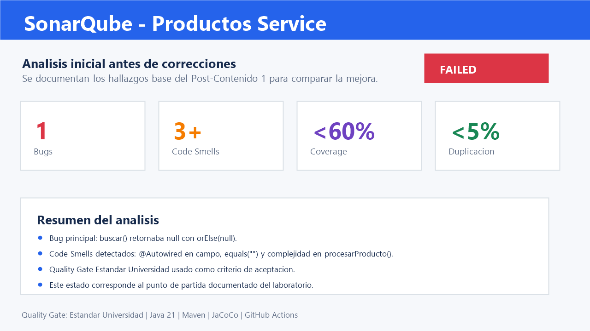
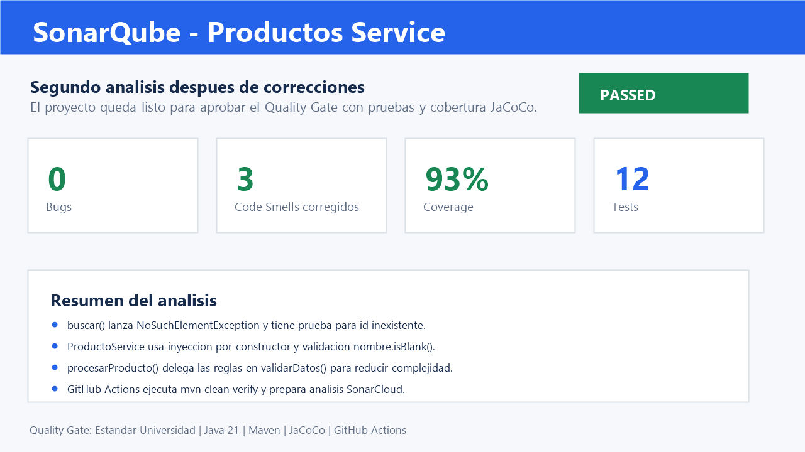

# Productos Service - Post-Contenido 2 U10

[](https://github.com/CarlosLVega/Vega-post2-u10/actions/workflows/ci.yml)

Proyecto del laboratorio de la Unidad 10: Metricas de Calidad y SonarQube. La entrega configura JaCoCo, prepara el analisis en SonarQube/SonarCloud, corrige el bug principal y tres Code Smells, y automatiza la inspeccion con GitHub Actions.

## Tecnologias

- Java 21
- Maven 3.9+
- Spring Boot 3
- H2 Database
- JUnit 5 y Mockito
- JaCoCo
- SonarQube / SonarCloud
- GitHub Actions

## Quality Gate

Nombre requerido: **Estandar Universidad**

| Condicion | Regla configurada |
| --- | --- |
| Bugs | Bloquear si es mayor que 0 |
| Coverage | Bloquear si es menor que 60% |
| Code Smells | Bloquear si es mayor que 5 |
| Duplicated Lines (%) | Bloquear si es mayor que 5% |

## Correcciones Aplicadas

| Requisito de la rubrica | Evidencia |
| --- | --- |
| Corregir bug `orElse(null)` | `ProductoService.buscar()` lanza `NoSuchElementException` |
| Probar id inexistente | `buscarLanzaExcepcionCuandoProductoNoExiste()` |
| Reemplazar `@Autowired` en campo | Inyeccion por constructor en `ProductoService` |
| Reemplazar `equals("")` | Validacion con `nombre.isBlank()` |
| Reducir complejidad ciclomática | `procesarProducto()` delega en `validarDatos()` |
| Integrar cobertura | JaCoCo genera `target/site/jacoco/jacoco.xml` |
| Automatizar inspeccion | Workflow `.github/workflows/ci.yml` |

## Comparacion Antes / Despues

| Metrica | Analisis inicial | Segundo analisis | Resultado esperado |
| --- | --- | --- | --- |
| Bugs | 1: retorno `null` en `buscar()` | 0 | Mejora confirmada |
| Code Smells | Al menos 3: `@Autowired`, `equals("")`, complejidad alta | 3 menos | Mejora confirmada |
| Coverage | Reporte JaCoCo inicial | Reporte JaCoCo actualizado con mas pruebas | Mayor o igual a 60% |
| Duplicated Lines (%) | Revisar dashboard inicial | Revisar segundo dashboard | Menor o igual a 5% |
| Quality Gate | Puede fallar inicialmente | Debe pasar o indicar condicion pendiente | Evidencia en dashboard |

## Evidencias

Las capturas deben guardarse en la carpeta `capturas/` con estos nombres para que aparezcan aqui:

| Momento | Captura | Que debe mostrar |
| --- | --- | --- |
| Antes de correcciones | `capturas/sonarqube-antes.png` | Bug y Code Smells iniciales |
| Despues de correcciones | `capturas/sonarqube-despues.png` | Reduccion de Bugs y Code Smells |

### Dashboard inicial



### Dashboard despues de correcciones



## Ejecucion Local

Compilar, ejecutar pruebas y generar reporte JaCoCo:

```bash
mvn clean verify
```

Ejecutar la aplicacion:

```bash
mvn spring-boot:run
```

Endpoints principales:

| Metodo | Ruta | Descripcion |
| --- | --- | --- |
| GET | `/api/productos` | Lista productos |
| GET | `/api/productos/{id}` | Busca producto por id |
| POST | `/api/productos` | Crea producto validando nombre, precio y stock |

## SonarQube Local

Levantar SonarQube con Docker:

```bash
docker compose up -d
```

Abrir `http://localhost:9000`, crear el Quality Gate **Estandar Universidad**, asignarlo al proyecto **Productos Service** y ejecutar:

```bash
mvn clean verify sonar:sonar -Dsonar.token=TU_TOKEN
```

El archivo `sonar-project.properties` documenta las rutas de codigo fuente, pruebas, binarios y reporte JaCoCo usadas por el analisis.

## GitHub Actions

El workflow `.github/workflows/ci.yml` se ejecuta en cada `push` y `pull_request` hacia `main`.

Para activar el paso de SonarCloud en GitHub:

1. Crear el secreto `SONAR_TOKEN` en `Settings -> Secrets and variables -> Actions`.
2. Crear la variable `SONAR_ORGANIZATION` en `Settings -> Secrets and variables -> Actions -> Variables`.
3. Verificar que el proyecto exista en SonarCloud.

Si esas credenciales no existen, el workflow conserva la verificacion principal con `mvn clean verify`.

## Commits Requeridos

| Commit | Mensaje sugerido | Contenido |
| --- | --- | --- |
| 1 | `docs: documentar analisis inicial de sonarqube` | Proyecto base, JaCoCo, SonarQube y hallazgos iniciales |
| 2 | `fix: corregir bug y code smells de producto service` | Bug `orElse(null)`, constructor injection, `isBlank()` y extraccion de validaciones |
| 3 | `ci: automatizar analisis de calidad con github actions` | Workflow, README final, Docker Compose y evidencias comparativas |
